# devPivot · AI 智能需求设计系统

> 把"一个模糊的产品想法"自动变成"可落地的需求文档 + 数据库设计"。

<p align="center">
  
</p>

<p align="center">
  
  
  
  
  
  
  
  
</p>

<details>
<summary>🇬🇧 English</summary>

**devPivot** is an AI-powered requirement design & database generation system. It turns a vague product idea into deliverables — requirement specs, PRD, prototype, tech design, and database DDL — through a 6-stage AI pipeline, augmented by a layered RAG knowledge base.

- **Frontend**: Vue 3 + Vite + Element Plus
- **Backend**: Spring Boot (multi-module) + MyBatis
- **Middleware**: MySQL 8.0 (ngram fulltext) + Redis 7

> License: Apache-2.0 — commercial use allowed.

</details>

---

## 目录

- [项目简介](#项目简介)
- [功能特性](#功能特性)
- [技术架构](#技术架构)
- [目录结构](#目录结构)
- [环境要求](#环境要求)
- [快速开始](#快速开始)
- [知识库（RAG）](#知识库-rag)
- [常见问题](#常见问题)
- [许可证](#许可证)
- [交流与反馈](#交流与反馈)

---

## 项目简介

devPivot 是一套面向产品 / 研发团队的 **AI 智能需求设计与数据库生成系统**。它将
「需求 → PRD → 原型 → 技术方案 → 库表设计」这条长链路，串成一条 **6 阶段 AI 流水线**，
每段都能基于上游产物与团队沉淀的知识库自动生成，让人从重复劳动中解放出来，只做确认与精修。

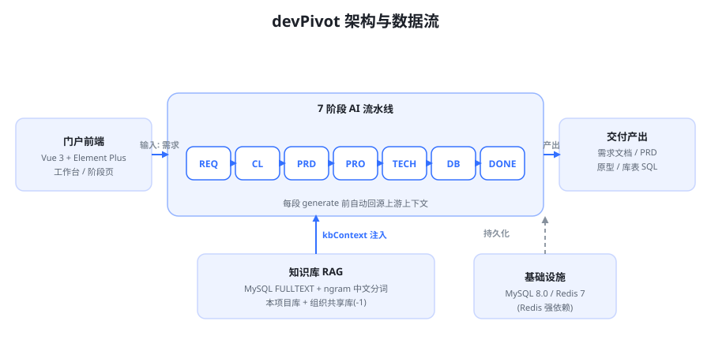

## 界面预览

> 点击任意图片可在新标签页打开大图预览。

### 登录页

**支持账号密码登录、注册入口**

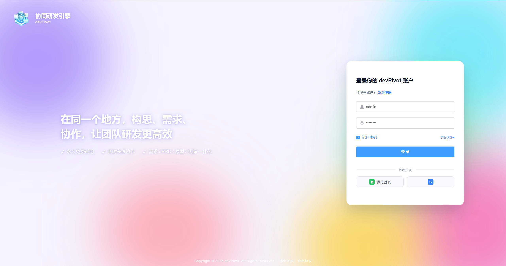

### 门户与项目

**门户首页（含「继续你的项目」精选区与项目列表）**

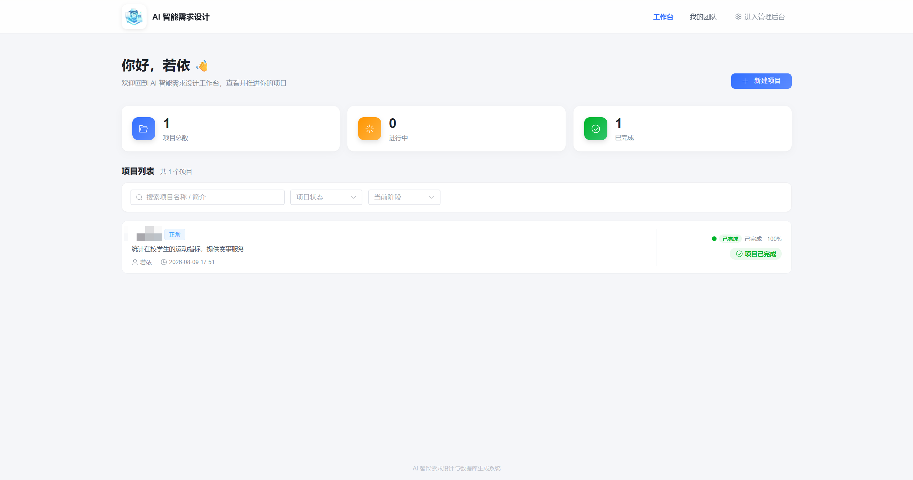

**创建项目**

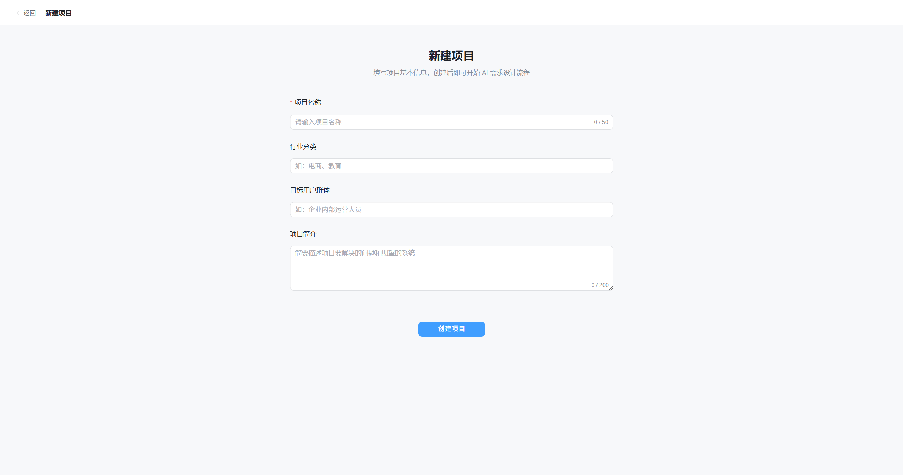

**项目总览页（阶段进度与快捷入口）**

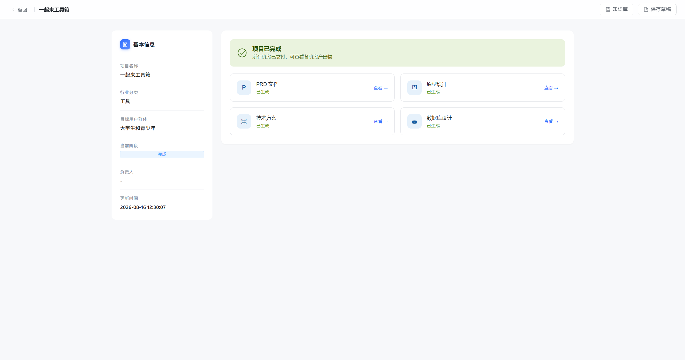

### 6 阶段 AI 工作台

<table>
  <tr>
    <td align="center" valign="top" width="50%">
      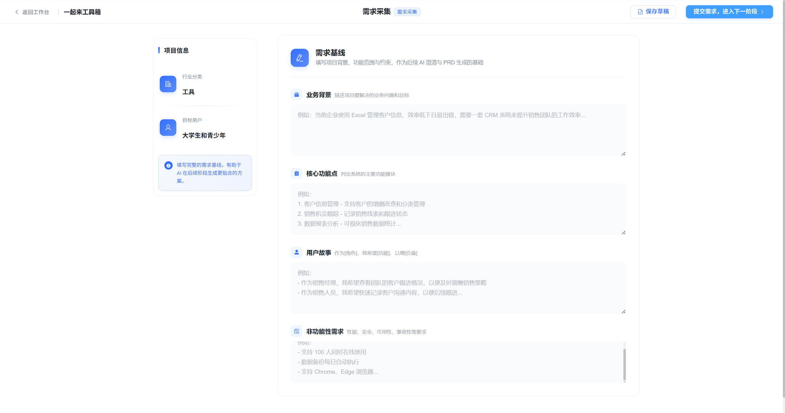<br/>
      <strong>需求采集 REQ</strong><br/>
      <div align="left">填写业务背景、核心功能点、用户故事与非功能性需求，沉淀为结构化需求基线，作为后续各阶段的统一输入。</div>
    </td>
    <td align="center" valign="top" width="50%">
      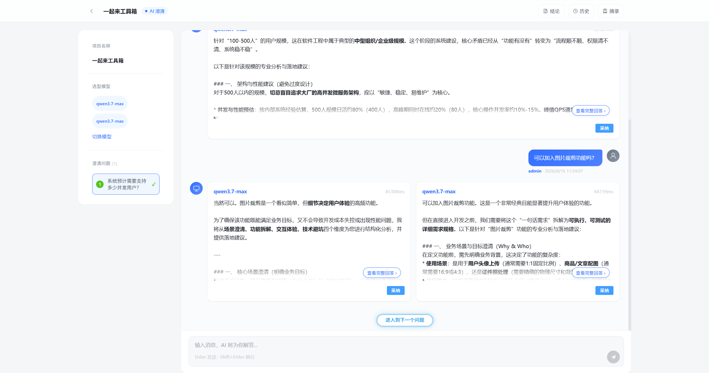<br/>
      <strong>AI 澄清 CLARIFY</strong><br/>
      <div align="left">同一澄清问题可并行调用多个大模型作答，围绕需求基线追问模糊点、补全业务约束，多模型答案横向对比后形成可回源确认的澄清结论。</div>
    </td>
  </tr>
  <tr>
    <td align="center" valign="top" width="50%">
      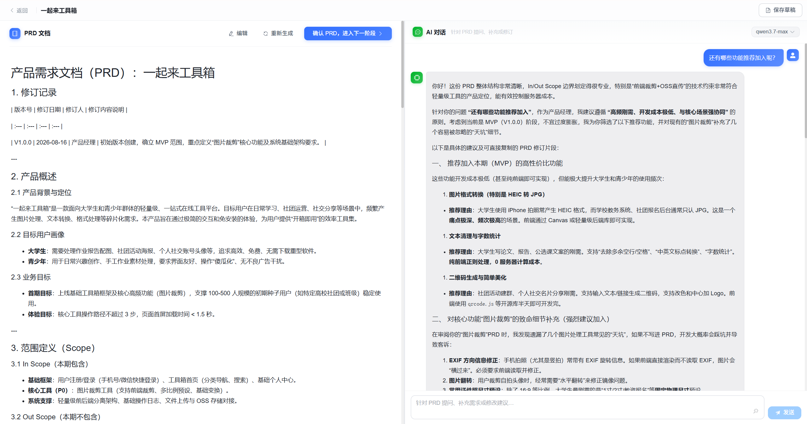<br/>
      <strong>产品需求文档 PRD</strong><br/>
      <div align="left">依据需求与澄清结论自动生成完整 PRD（角色 / 功能 / 流程 / 验收标准），支持流式对话式精修。</div>
    </td>
    <td align="center" valign="top" width="50%">
      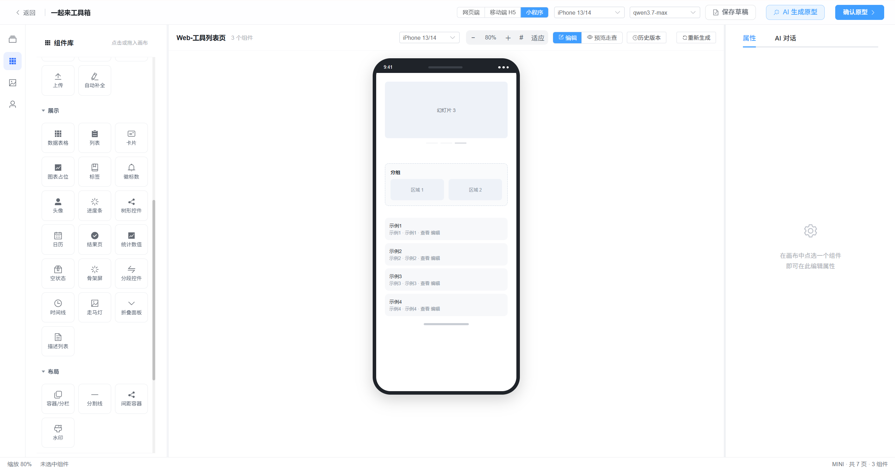<br/>
      <strong>原型设计 PROTO</strong><br/>
      <div align="left">产出可拖拽的高保真原型页面与组件，支持 AI 辅助生成与多端预览，快速验证交互。</div>
    </td>
  </tr>
  <tr>
    <td align="center" valign="top" width="50%">
      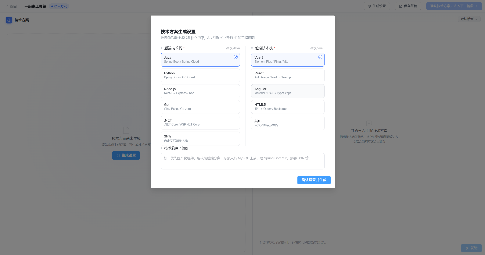<br/>
      <strong>技术方案 TECH</strong><br/>
      <div align="left">自动生成技术方案（架构 / 模块 / 接口 / 技术选型），回源 PRD 保证方案与需求对齐。</div>
    </td>
    <td align="center" valign="top" width="50%">
      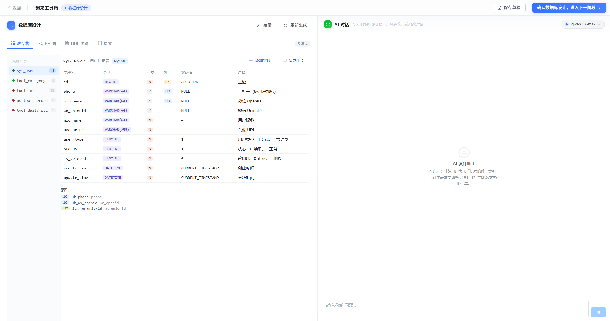<br/>
      <strong>数据库设计 DB</strong><br/>
      <div align="left">依据技术方案生成库表结构与 SQL（含字段注释与索引建议），一键导出可落地的 DDL。</div>
    </td>
  </tr>
</table>

## 功能特性

- 🔗 **6 阶段 AI 流水线**：需求采集 → AI 澄清 → PRD → 原型 → 技术方案 → 数据库设计，各阶段生成时自动回源读取上游文档上下文。
- 📚 **分层知识库（RAG）**：每个项目 = 1 个全局库 + 6 个阶段库（需求 / 澄清 / PRD / 原型 / 技术方案 / 数据库），生成时叠加团队沉淀的领域知识。
- 🌐 **组织共享知识库**：支持跨项目共享（`project_id = -1` 约定），共享库同样按「1 全局 + 6 阶段」逻辑分区。
- 🖥️ **工作台门户**：首页即可"继续手头的项目"，项目列表内联阶段进度，一步直达当前阶段。
- ⚙️ **内置后台管理**：用户 / 角色 / 菜单 / 字典 / 权限 / 代码生成 / 定时任务等开箱即用。

### 6 阶段流水线

| 阶段 | 代号 | 主要产出 | 主要特色 |
| :--- | :--- | :--- | :--- |
| 需求采集 | `REQ` | 需求描述 | 填写业务背景、核心功能点、用户故事等，沉淀为结构化需求基线，作为后续各阶段统一输入 |
| AI 澄清 | `CLARIFY` | 澄清问答 | 多模型并行作答；AI 依据需求基线与对话历史动态追问模糊点，补全业务约束 |
| 产品需求文档 | `PRD` | PRD 文档 | 基于需求与澄清结论自动生成完整 PRD，支持流式对话式精修 |
| 原型 | `PROTO` | 原型 | 墨刀式可拖拽高保真原型编辑器，支持 AI 辅助生成与多端预览 |
| 技术方案 | `TECH` | 技术方案 | 回源 PRD 自动生成架构、模块、接口与技术选型 |
| 数据库设计 | `DB` | 库表 SQL | 基于技术方案生成可落地的库表 DDL，含字段注释与索引建议 |

## 技术架构

### 前端 `devpivot-admin`（Vue 3 + Vite）

| 类别 | 技术 |
| :--- | :--- |
| 框架 | Vue 3.5 |
| 构建 | Vite 6 |
| UI 组件库 | Element Plus 2.13 |
| 状态管理 | Pinia 3 |
| 路由 | Vue Router 4 |
| 语言 | JavaScript |

### 后端 `devpivot-boot`（Spring Boot 多模块）

| 类别 | 技术 |
| :--- | :--- |
| 框架 | Spring Boot 4.0.6 / Spring Security |
| 持久层 | MyBatis + Druid 连接池 |
| 鉴权 | JWT + Redis |
| JSON | fastjson2（`com.alibaba.fastjson2`） |
| JDK | 17 |
| 构建 | Maven |

### 中间件

| 组件 | 版本要求 | 说明 |
| :--- | :--- | :--- |
| MySQL | 8.0+ | 知识库中文检索依赖 InnoDB `FULLTEXT` + `ngram` 分词器 |
| Redis | 7+ | **强依赖**，未启动会导致后端启动失败 |

### 模块依赖边界

> `ruoyi-ai`（引擎层）仅依赖 `ruoyi-common`；`ruoyi-project`（业务域）依赖
> `ruoyi-common` + `ruoyi-ai`，**单向不反向**。门户接口按约定仅校验登录态、放开后台权限。

## 目录结构

```text
devPivot/
├── devpivot-admin/          # 前端 (Vue3 + Vite + Element Plus)
│   ├── src/
│   │   ├── api/             # 接口封装
│   │   ├── views/portal/    # 门户工作台（首页、项目详情、各阶段）
│   │   ├── assets/logo/     # 品牌 logo
│   │   └── ...
│   ├── package.json
│   └── vite.config.js
├── devpivot-boot/           # 后端 (Spring Boot 多模块)
│   ├── ruoyi-admin/         # 启动模块 (含 main 类)
│   ├── ruoyi-ai/            # AI 引擎层 (纯引擎，不反向依赖业务)
│   ├── ruoyi-project/       # AI 需求设计业务域模块
│   ├── ruoyi-system/        # 系统模块 (用户/角色/菜单/字典)
│   ├── ruoyi-framework/     # 框架模块
│   ├── ruoyi-common/        # 通用工具
│   ├── ruoyi-quartz/        # 定时任务
│   ├── ruoyi-generator/     # 代码生成
│   ├── sql/                 # 数据库初始化脚本 (kb_ddl.sql / kb_menu.sql ...)
│   └── pom.xml              # 聚合 POM (Java 17)
├── docs/                    # 设计文档与架构图
└── README.md
```

## 环境要求

- **JDK 17**（构建与运行均须；若本机默认 `JAVA_HOME` 指向 JDK 8，请显式指定 JDK 17）
- **Node.js 18+**（建议使用 22）
- **MySQL 8.0+**
- **Redis 7+**
- **Maven 3.8+**

## 快速开始

### 1. 准备数据库与缓存

```bash
# 1) 创建数据库（字符集 utf8mb4）
mysql -u root -p -e "CREATE DATABASE devpivot DEFAULT CHARACTER SET utf8mb4 COLLATE utf8mb4_general_ci;"

# 2) 执行项目提供的 DDL 与种子脚本（位于 devpivot-boot/sql/）
#    例如知识库表与菜单种子（按需执行其余随模块提供的 DDL）：
mysql -u root -p devpivot --default-character-set=utf8mb4 < devpivot-boot/sql/kb_ddl.sql
mysql -u root -p devpivot --default-character-set=utf8mb4 < devpivot-boot/sql/kb_menu.sql

# 3) 启动 Redis
redis-server
```

> 提示：执行含中文的 SQL 文件务必加 `--default-character-set=utf8mb4`，
> 否则客户端会按 latin1 解析中文而报 `Incorrect string value`。

### 2. 配置后端

编辑 `devpivot-boot/ruoyi-admin/src/main/resources/application.yml`：

- `spring.datasource`：MySQL 地址 / 库名 / 账号 / 密码
- `spring.data.redis`：Redis 地址 / 端口 / 密码
- `ruoyi.profile`：文件上传路径（如 `D:/ruoyi/uploadPath`）

后端默认端口 **8080**，上下文路径 `/`。

### 3. 启动后端

方式一（Maven 构建后运行 jar）：

```bash
cd devpivot-boot
# 使用 JDK 17 编译打包（本机默认 JDK 8 时需显式指定）
JAVA_HOME=/path/to/jdk17 mvn clean package -DskipTests
java -jar ruoyi-admin/target/ruoyi-admin.jar
```

方式二（IDE 直接运行）：以 JDK 17 运行启动类 `com.ruoyi.RuoYiApplication`。

### 4. 启动前端

```bash
cd devpivot-admin
npm install      # 安装依赖
npm run dev      # 开发模式，默认端口 80，自动打开浏览器
```

前端开发服务器将代理 `/dev-api` → `http://localhost:8080`（见 `vite.config.js`），
访问 **http://localhost** 即可打开系统。

### 5. 默认账号

系统初始化数据中的管理员账号（一般 `admin` / `admin123`），以实际初始化数据为准。

## 知识库（RAG）

知识库采用 **MySQL InnoDB `FULLTEXT` + `ngram` 中文分词** 的轻量检索方案（暂不引入向量库），
按 `(project_id, stage)` 物理分区、逻辑分库：

- 每项目 = 1 个全局库（`stage = NULL`）+ 6 个阶段库（`REQ/CLARIFY/PRD/PROTO/TECH/DB`）。
- 组织共享库：`project_id = -1`，检索时自动合并「本项目库 ∪ 共享库」。
- 生成时由流水线在 `generate` 前调用 `retrieveAsContext(projectId, stage, query)` 注入 `kbContext`，
  模板无命中时安全降级（保留占位符，不报错）。

## 常见问题

1. **后端启动失败 / 连接拒绝**
   多半是 Redis 未启动（强依赖）。启动 Redis 后重试。

2. **AI 流式（SSE）一直"思考中"不返回**
   `vite.config.js` 已对 `text/event-stream` 响应关闭代理缓冲；若自行部署网关 / nginx，
   需对 SSE 路径设置 `X-Accel-Buffering: no` 并禁用缓存。

3. **知识库中文检索无命中**
   确认 MySQL 为 8.0+ 且表使用 `FULLTEXT(content, tags) WITH PARSER ngram`；
   低版本或缺失 ngram 解析器将无法正确分词。

4. **编译报"程序包不存在"（fastjson）**
   后端统一使用 `com.alibaba.fastjson2`，不要混用旧版 `com.alibaba.fastjson`。

## 许可证

本项目采用 **Apache License 2.0（Apache-2.0）** 许可，允许自由使用、修改、分发（**包括商用**），并额外提供明确的专利授权。

- 你可以将本项目用于商业产品、对外提供服务、或基于此进行二次开发。
- 分发时须保留原始版权声明与本许可文件（LICENSE）；若修改了源文件，须在文件中显著标注修改说明。
- 若项目随附 `NOTICE` 文件，分发时须一并保留其中的署名声明（用于满足上游 RuoYi 等组件的署名要求）。
- 本许可**明确授予专利使用权**；但一旦你针对本项目发起专利侵权诉讼，该专利授权将自动终止。
- 本许可不授予商标使用权；软件按"现状"提供，不作任何明示或暗示担保，作者不对使用后果负责。


## 交流与反馈

欢迎通过 **Issue** 反馈问题、提交 **Pull Request** 贡献代码，或交流使用心得。
如果你基于此项目做了有意思的延伸，也欢迎分享。

---

<p align="center">Made with ❤️ for learning · devPivot</p>
